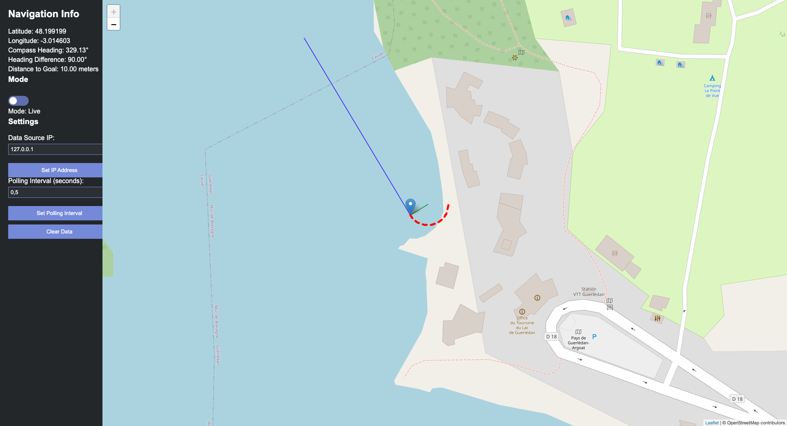
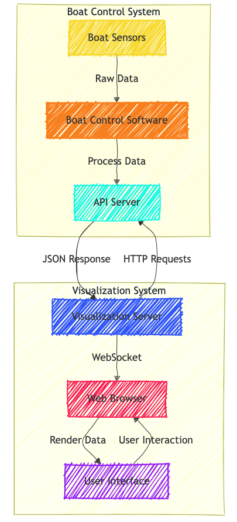

# 🚤 Boat Navigation Visualization Addon



## 🌟 Overview

This is an addon tool for ddboats used by [ENSTA Bretagne](https://www.ensta-bretagne.fr/en). It provides real-time visualization of navigation data and allows for historical data playback. The tool offers an interactive map interface to display the boat's position, heading, and trajectory.

## 🛠️ Installation

### Prerequisites

- Python 3.6+
- Flask
- Flask-SocketIO
- Requests

### Adding to Your Boat Control Software

To integrate this visualization addon with your existing boat control software, you need to add an API server component. Here's a minimal example based on the [DDBoat](https://github.com/MasterVotr/DDBoat) script:

```python
from http.server import HTTPServer, BaseHTTPRequestHandler
from threading import Thread
import json

latest_nav_data = {}

class SimpleHTTPRequestHandler(BaseHTTPRequestHandler):
    def do_GET(self):
        if self.path == '/api/nav_data':
            self.send_response(200)
            self.send_header('Content-type', 'application/json')
            self.end_headers()
            self.wfile.write(json.dumps(latest_nav_data).encode())
        else:
            self.send_response(404)
            self.end_headers()
            self.wfile.write(b'404 Not Found')

def run_server(port=8000):
    server_address = ('0.0.0.0', port)
    httpd = HTTPServer(server_address, SimpleHTTPRequestHandler)
    print(f"Server running on port {port}")
    httpd.serve_forever()

# Start the server in a separate thread
server_thread = Thread(target=run_server)
server_thread.daemon = True
server_thread.start()

# In your main navigation loop, update the latest_nav_data:
latest_nav_data = {
    "timestamp": current_timestamp,
    "position": {"lat": latitude, "lon": longitude},
    "distance_to_ref": distance_to_reference,
    "angle_to_ref": angle_to_reference,
    "compass_heading": compass_heading
}
```

### Setting Up the Visualization Tool

1. Clone this repository:
   ```
   git clone https://github.com/MasterVotr/DDBoat.git
   ```

2. Run the visualization server:
   ```
   python nav_data_app.py
   ```

3. Open a web browser and navigate to `http://localhost:5000` to view the visualization.

## 🎨 Features

- **Real-time Visualization**: See your boat's position, heading, and trajectory in real-time.
- **Interactive Map**: Pan, zoom, and explore your navigation data on an interactive map.
- **Historical Data Playback**: Review past navigation data with an intuitive timeline slider.
- **Customizable Settings**: Adjust data source IP and polling rate to fit your setup.

## 🔧 How It Works

1. **Data Collection**: Your boat control software sends navigation data to the API server.
2. **Data Transmission**: The visualization server polls the API for updates.
3. **Real-time Updates**: New data is sent to connected clients via WebSocket.
4. **Visualization**: The web interface renders the data on an interactive map.

## 🔍 Architecture



## 📊 Data Format

The API server should return JSON data in the following format:

```json
{
  "timestamp": "2023-05-20T14:30:00Z",
  "position": {
    "lat": 48.8566,
    "lon": 2.3522
  },
  "distance_to_ref": 1000.5,
  "angle_to_ref": 45.3,
  "compass_heading": 270.0
}
```

## 👨‍💻 Created by

- Jakub Votrubec
  - GitHub: [MasterVotr](https://github.com/MasterVotr)

- Johannes v. Grundherr
  - GitHub: [Johannes-ece](https://github.com/Johannes-ece)

- Matic "Mato" Puhar
  - LinkedIn: [LinkedIn](https://www.linkedin.com/in/matic-mato-puhar?utm_source=share&utm_campaign=share_via&utm_content=profile&utm_medium=android_app)